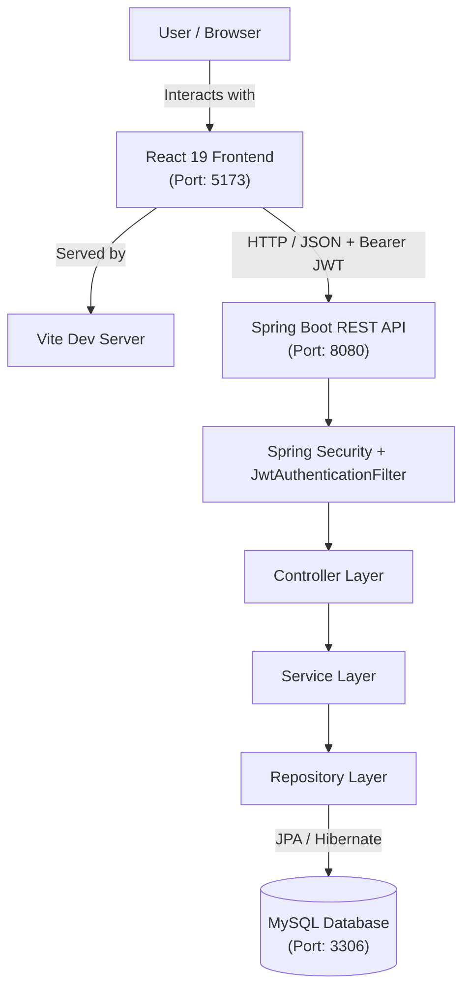
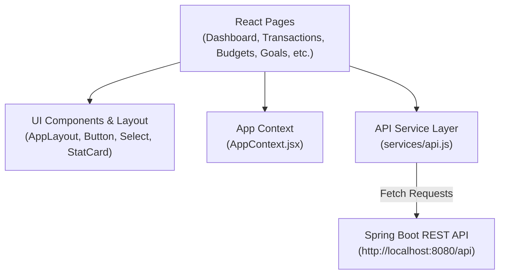
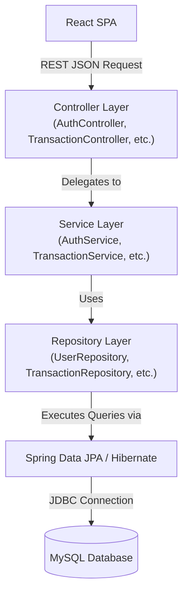
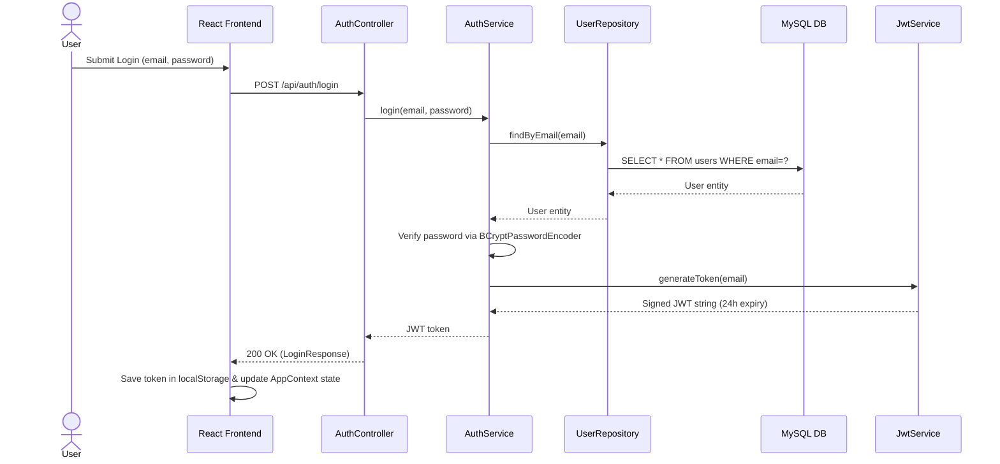
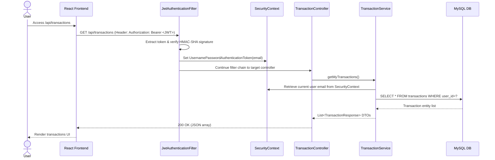
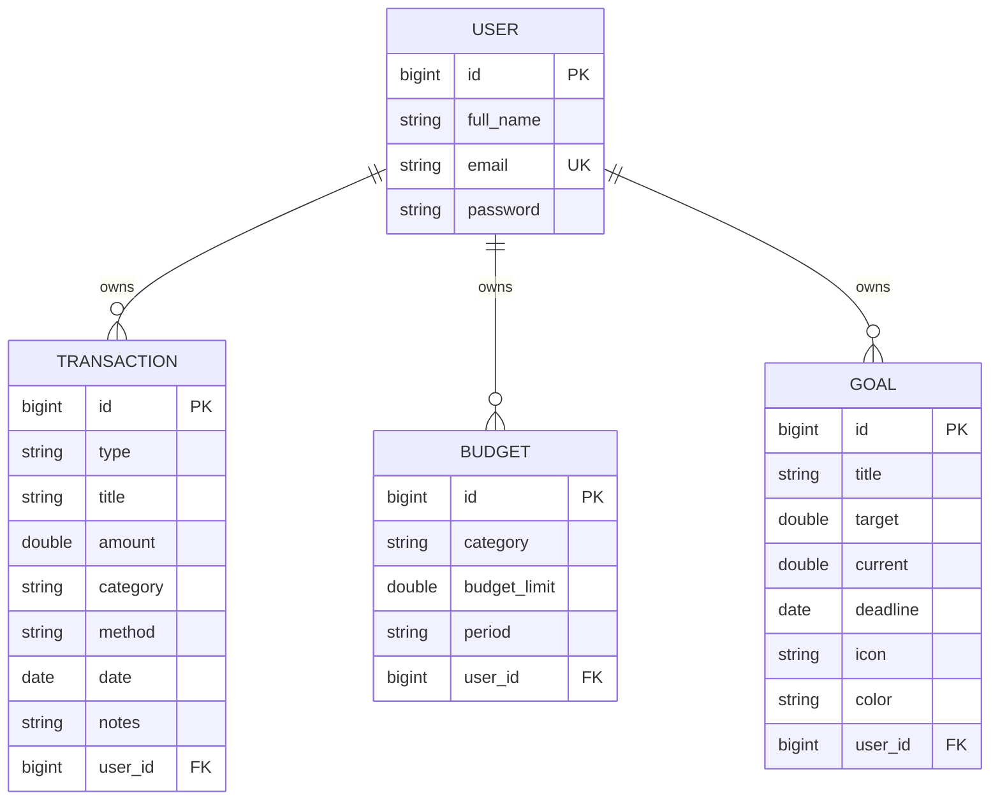
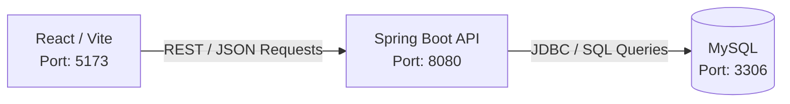

# 💰 Expense Tracker

A full-stack personal finance management application built with **React** and **Spring Boot**. The application allows users to securely manage their income and expenses, create budgets and savings goals, view financial analytics, and manage user profiles with real-time financial tracking and data visualization.

---

## 📌 1. PROJECT OVERVIEW

**Expense Tracker** is a full-stack personal finance management system designed to simplify personal budgeting and money tracking. It addresses the common challenge of unorganized financial tracking by providing a secure, centralized dashboard for recording transactions, establishing category budgets, monitoring savings goals, and visualizing spending trends.

### Why It Was Built & Who It Is For
Built with a modern client-server architecture, Expense Tracker is tailored for individual users and professionals who want clear visibility into their financial habits. The application features built-in localization defaults tailored for Sri Lankan users (such as default currency formatting in **LKR / Rs.** and multi-language UI support for **English**, **Sinhala**, and **Tamil**), while remaining fully configurable for international currencies.

---

## ✨ 2. KEY FEATURES

| Feature Area | Description |
| :--- | :--- |
| **Authentication** | User registration, login, JWT issuance, BCrypt password hashing, and stateless session control. |
| **Transactions** | Full CRUD for income and expenses with title, amount, category, payment method, date, and notes. |
| **Budgets** | Category-based budget limits with real-time spent, remaining, and percentage progress calculations. |
| **Savings Goals** | Target savings goals with deadline tracking, progress rings, remaining amount, and days remaining. |
| **Dashboard** | Financial summary metrics (total income, total expenses, net balance), monthly overviews, and category spending breakdown. |
| **Analytics** | Graphical financial trends (monthly trends, income vs. expense, category spending) using Recharts. |
| **Profile** | User profile management exposing name, email, and account info without leaking credentials. |
| **Settings** | Preference controls for Currency (`Rs.`, `$`, `€`, `£`), Theme (Light/Dark mode), and Language (English, Sinhala, Tamil). |

### Feature Details

- **🔐 Authentication & Access Control:** Users register and authenticate using email and password. Protected REST API endpoints require a valid JWT passed in the `Authorization: Bearer <token>` header.
- **💸 Transaction Management:** Users can record, edit, and delete transactions. Transactions are categorized (e.g., Food, Transport, Salary, Bills) and marked with payment methods (e.g., Cash, Card, Bank Transfer).
- **💰 Budget Limits:** Set category spending limits for specific periods. Automatically updates spent and remaining amounts when transactions are added or modified.
- **🎯 Financial Savings Goals:** Track long-term savings (e.g., Emergency Fund) with target amounts, current saved totals, target dates, custom icons, and visual progress indicators.
- **📈 Visual Analytics:** Dynamic charts powered by Recharts render monthly spending trends, category proportions, and income vs. expense ratios.
- **⚙️ Regional Preference Support:** Built-in support for Sri Lankan Rupee (`Rs.`), US Dollar (`$`), Euro (`€`), and British Pound (`£`), alongside UI language options for English (🇬🇧), Sinhala (🇱🇰), and Tamil (🇱🇰).

---

## 🛠️ 3. TECHNOLOGY STACK

| Layer | Technology | Exact Version | Purpose |
| :--- | :--- | :--- | :--- |
| **Frontend Framework** | React | `^19.0.0` | Declarative component-based UI |
| **Frontend Build Tool** | Vite | `^8.0.0` | Development server & fast module bundling |
| **Routing** | React Router DOM | `^7.18.2` | Client-side page navigation |
| **Styling** | Tailwind CSS | `^4.0.0` | Utility-first CSS styling (`@tailwindcss/vite`) |
| **Data Visualization** | Recharts | `^3.10.1` | Financial analytics & interactive charts |
| **Icons** | Lucide React | `^1.31.0` | Modern SVG icons |
| **Backend Framework** | Spring Boot | `4.1.0` parent (Spring 3.2.5 runtime) | RESTful web services & backend application framework |
| **Language & JDK** | Java | `17` configured (JDK 21 compatible) | Core backend programming language |
| **Security Framework** | Spring Security | 6.x | API protection, CORS & filter chain configuration |
| **Authentication Token** | JJWT (io.jsonwebtoken) | `0.12.6` | Stateless JWT generation and verification |
| **Password Hashing** | BCrypt | `BCryptPasswordEncoder` | Secure one-way password hashing |
| **ORM & Persistence** | Spring Data JPA / Hibernate | 6.x | Entity-relational mapping & database repository pattern |
| **Database Engine** | MySQL | `8.3.0` driver / Port `3306` | Relational data store (`expense_tracker` database) |
| **Build & Dependency Tool**| Maven Wrapper (`mvnw.cmd`) | `3.x` | Cross-platform reproducible build execution |
| **Version Control** | Git / GitHub | -- | Distributed version control & source code management |

---

## 🏗️ 4. SYSTEM ARCHITECTURE

The application implements a decoupled client-server architecture where the React SPA communicates exclusively over HTTP REST APIs with the Spring Boot backend service.



---

## 💻 5. FRONTEND ARCHITECTURE

The frontend is structured into modular React components, custom context providers, page views, and centralized HTTP request handlers.



### Core Frontend Modules
- **Pages:** `Dashboard.jsx`, `Transactions.jsx`, `AddTransaction.jsx`, `Budgets.jsx`, `Goals.jsx`, `Analytics.jsx`, `Profile.jsx`, `Settings.jsx`, `Login.jsx`, `Register.jsx`.
- **Context Management:** `AppContext.jsx` manages user state, authentication status, theme (`light`/`dark`), language (`en`/`si`/`ta`), currency symbol (`Rs.`), and cached entity data.
- **Service Layer (`services/api.js`):** Encapsulates native `fetch` logic, attaching `Authorization: Bearer <token>` headers to outgoing requests and standardizing error handling.

---

## ⚙️ 6. BACKEND ARCHITECTURE

The Spring Boot backend enforces a clean layered architecture to isolate API handling, business rules, and database persistence.



### Layer Responsibilities
1. **Controller Layer:** Maps HTTP routes (`/api/...`), parses request bodies, validates input DTOs, and returns `ResponseEntity<T>` JSON objects.
2. **Service Layer:** Executes core business logic, computes financial calculations, enforces user ownership checks, and calls repositories.
3. **Repository Layer:** Extends `JpaRepository<T, ID>` to provide type-safe CRUD database operations.
4. **Entity Layer:** Annotated Java classes representing MySQL database tables (`users`, `transactions`, `budgets`, `goals`).
5. **DTO Layer:** Transfer objects (`LoginRequest`, `TransactionResponse`, `DashboardResponse`, `UserProfileResponse`, etc.) that safeguard sensitive entity details.

---

## 🔐 7. AUTHENTICATION FLOW

Authentication is stateless and powered by JSON Web Tokens (JWT). Passwords are never stored in plain text.



---

## 🔄 8. AUTHENTICATED REQUEST FLOW

Every protected request includes the user's JWT token in the `Authorization` header.



---

## 🧠 9. AUTHENTICATION VS AUTHORIZATION

- **Authentication ("Who are you?"):** Handled when the user logs in. The system verifies credentials against BCrypt hashes and issues a 24-hour signed JWT containing the user's email.
- **Authorization ("What are you allowed to access?"):** Handled on every request. Spring Security requires requests to be authenticated (`.anyRequest().authenticated()`). Furthermore, service methods extract the authenticated user's email directly from `SecurityContextHolder` to scope queries exclusively to records owned by that user (`WHERE user_id = :userId`). A user cannot view, edit, or delete another user's transactions, budgets, goals, or profile data.

---

## 🛡️ 10. SECURITY ARCHITECTURE

| Security Mechanism | Implementation Details |
| :--- | :--- |
| **Authentication Token** | JSON Web Token (JWT) via JJWT `0.12.6` |
| **Token Expiration** | 24 Hours (`86400000` ms) |
| **Token Signing** | HMAC-SHA with 256-bit secret key |
| **Password Hashing** | `BCryptPasswordEncoder` |
| **Session Policy** | `SessionCreationPolicy.STATELESS` |
| **Request Filter** | `JwtAuthenticationFilter` executing before `UsernamePasswordAuthenticationFilter` |
| **CORS Configuration** | Allowed origins: `http://localhost:*`, `http://127.0.0.1:*`; Methods: `GET`, `POST`, `PUT`, `DELETE`, `OPTIONS`, `PATCH` |
| **CSRF Configuration** | Disabled (`csrf.disable()`) for stateless REST APIs |
| **Public Routes** | `POST /api/auth/register`, `POST /api/auth/login` |
| **Data Isolation** | User ownership checks enforced in Service layer |

---

## 👤 11. USER HANDLING & DATA ISOLATION

Data security relies on server-managed identity extraction rather than trusting user IDs supplied by the frontend.

```text
Incoming JWT ──> JwtAuthenticationFilter ──> Extract Email ──> SecurityContext
                                                                   │
                                                                   ▼
MySQL Database <── Filter Query by User ID <── Lookup User <── Current User Email
```

1. **Email Resolution:** The service layer obtains `SecurityContextHolder.getContext().getAuthentication().getName()` to resolve the authenticated email.
2. **User Scope:** The system queries `UserRepository.findByEmail(email)` to fetch the user entity.
3. **Database Scoping:** All operations (`findByUser`, `findByUserAndCategory`, etc.) pass the fetched `User` entity to ensure users only mutate their own financial data.

---

## 🗄️ 12. DATABASE ARCHITECTURE

The application uses MySQL relational storage managed by Spring Data JPA and Hibernate (`spring.jpa.hibernate.ddl-auto=update`).



---

## 🌐 13. API DOCUMENTATION

### Authentication Endpoints (`/api/auth`)
| Method | Endpoint | Auth | Description |
| :--- | :--- | :--- | :--- |
| `POST` | `/api/auth/register` | Public | Register a new user (`fullName`, `email`, `password`) |
| `POST` | `/api/auth/login` | Public | Authenticate user & return JWT token |

### Transaction Endpoints (`/api/transactions`)
| Method | Endpoint | Auth | Description |
| :--- | :--- | :--- | :--- |
| `GET` | `/api/transactions` | Bearer JWT | Retrieve all transactions for authenticated user |
| `POST` | `/api/transactions` | Bearer JWT | Create a new transaction |
| `PUT` | `/api/transactions/{id}` | Bearer JWT | Update an existing transaction |
| `DELETE` | `/api/transactions/{id}` | Bearer JWT | Delete a transaction |

### Budget Endpoints (`/api/budgets`)
| Method | Endpoint | Auth | Description |
| :--- | :--- | :--- | :--- |
| `GET` | `/api/budgets` | Bearer JWT | Fetch budgets with calculated spent and remaining totals |
| `POST` | `/api/budgets` | Bearer JWT | Create a category budget limit |
| `PUT` | `/api/budgets/{id}` | Bearer JWT | Update budget category or limit |
| `DELETE` | `/api/budgets/{id}` | Bearer JWT | Delete a category budget |

### Savings Goal Endpoints (`/api/goals`)
| Method | Endpoint | Auth | Description |
| :--- | :--- | :--- | :--- |
| `GET` | `/api/goals` | Bearer JWT | Retrieve savings goals with progress calculations |
| `POST` | `/api/goals` | Bearer JWT | Create a new financial savings goal |
| `PUT` | `/api/goals/{id}` | Bearer JWT | Update goal details or saved amounts |
| `DELETE` | `/api/goals/{id}` | Bearer JWT | Delete a savings goal |

### Dashboard Endpoints (`/api/dashboard`)
| Method | Endpoint | Auth | Description |
| :--- | :--- | :--- | :--- |
| `GET` | `/api/dashboard` | Bearer JWT | Summary totals (Total Income, Expenses, Balance, Recent Txns) |
| `GET` | `/api/dashboard/monthly` | Bearer JWT | Monthly breakdown overview |
| `GET` | `/api/dashboard/categories` | Bearer JWT | Spending totals per category |

### Analytics Endpoints (`/api/analytics`)
| Method | Endpoint | Auth | Description |
| :--- | :--- | :--- | :--- |
| `GET` | `/api/analytics?range=month` | Bearer JWT | Financial visualization metrics for selected timeframe |

### User Profile Endpoints (`/api/users`)
| Method | Endpoint | Auth | Description |
| :--- | :--- | :--- | :--- |
| `GET` | `/api/users/me` | Bearer JWT | Fetch profile data for authenticated user |
| `PUT` | `/api/users/me` | Bearer JWT | Update name or email for authenticated user |

---

## 🔌 14. PORTS & SERVICE MAPPING

| Service | Port | Base URL / Connection |
| :--- | :--- | :--- |
| **React Frontend (Vite)** | `5173` | `http://localhost:5173/` |
| **Spring Boot REST API** | `8080` | `http://localhost:8080/api` |
| **MySQL Database** | `3306` | `jdbc:mysql://localhost:3306/expense_tracker` |



---

## 📁 15. PROJECT STRUCTURE

```text
expensess-tracker/
├── frontend/
│   ├── src/
│   │   ├── components/
│   │   │   ├── layout/       # AppLayout, Navbar, Sidebar
│   │   │   ├── ui/           # Button, Input, Modal, Select
│   │   │   └── transactions/ # Transaction filters & cards
│   │   ├── context/          # AppContext.jsx
│   │   ├── data/             # mockData.js, translations.js
│   │   ├── pages/            # Dashboard, Transactions, Budgets, Goals, Analytics, Profile, Settings, Login, Register
│   │   └── services/         # api.js
│   ├── index.html
│   ├── package.json
│   ├── tsconfig.json
│   └── vite.config.ts
├── src/
│   ├── main/
│   │   ├── java/com/example/expensesstracker/
│   │   │   ├── config/       # SecurityConfig, JwtAuthenticationFilter
│   │   │   ├── controller/   # Auth, Transaction, Budget, Goal, Dashboard, Analytics, User controllers
│   │   │   ├── dto/          # LoginRequest, TransactionResponse, DashboardResponse, etc.
│   │   │   ├── entity/       # User, Transaction, Budget, Goal
│   │   │   ├── repository/   # JpaRepositories
│   │   │   ├── service/      # Auth, Jwt, Transaction, Budget, Goal, Dashboard, Analytics, User services
│   │   │   └── ExpensessTrackerApplication.java
│   │   └── resources/
│   │       └── application.properties
│   └── test/
├── .gitignore
├── mvnw
├── mvnw.cmd
├── pom.xml
└── README.md
```

---

## 🔄 16. FRONTEND ↔ BACKEND COMMUNICATION

Communication relies on standard JSON over HTTP:

1. **Request Construction:** `frontend/src/services/api.js` builds HTTP calls targeting `http://localhost:8080/api`.
2. **Token Injection:** `api.js` inspects `localStorage.getItem('token')` and appends `Authorization: Bearer <token>` to headers.
3. **Backend Processing:** Spring Security intercepts the request, `JwtAuthenticationFilter` validates token signature, and the controller executes.
4. **JSON Parsing:** Response payload is returned as JSON and parsed by `request()` helper.

---

## 📊 17. FINANCIAL CALCULATIONS

All summary statistics are calculated server-side from transaction records:

- **Total Income:**  
  $$\text{Total Income} = \sum \text{amount where type} = \text{"income"}$$
- **Total Expenses:**  
  $$\text{Total Expenses} = \sum \text{amount where type} = \text{"expense"}$$
- **Net Balance:**  
  $$\text{Net Balance} = \text{Total Income} - \text{Total Expenses}$$
- **Budget Remaining & Percentage:**  
  $$\text{Spent} = \sum \text{expense amount in budget category}$$  
  $$\text{Remaining} = \text{Budget Limit} - \text{Spent}$$  
  $$\text{Percentage Used} = \min\left(100, \left(\frac{\text{Spent}}{\text{Budget Limit}}\right) \times 100\right)$$
- **Savings Goal Progress:**  
  $$\text{Progress \%} = \min\left(100, \left(\frac{\text{Current Saved}}{\text{Target Amount}}\right) \times 100\right)$$

---

## 📝 18. API REQUEST EXAMPLE

### 1. Register User
`POST /api/auth/register`
```json
{
  "fullName": "Test User",
  "email": "user@example.com",
  "password": "SecurePassword123!"
}
```

### 2. Login User
`POST /api/auth/login`
```json
{
  "email": "user@example.com",
  "password": "SecurePassword123!"
}
```

**Response (200 OK):**
```json
{
  "token": "eyJhbGciOiJIUzI1NiJ9.eyJzdWIiOiJ1c2VyQGV4YW1wbGUuY29tIiwiaWF0IjoxNzI...[JWT_STRING]"
}
```

### 3. Create Transaction (Authenticated)
`POST /api/transactions`  
*Header:* `Authorization: Bearer eyJhbGciOi...`
```json
{
  "title": "Grocery Shopping",
  "amount": 4500.00,
  "type": "expense",
  "category": "Food",
  "method": "Card",
  "date": "2026-08-14",
  "notes": "Supermarket purchase"
}
```

---

## 🖥️ 19. SETUP & INSTALLATION

### Prerequisites
- **Node.js** (v18+)
- **Java JDK 21** (or JDK 17+)
- **MySQL Server** (running on port `3306`)
- **Git**

---

### 🚀 Step 1: Start Backend (Spring Boot)

1. Open PowerShell in project root:
   ```powershell
   cd "d:\projects\expensess tracker\expensess tracker"
   ```
2. Set JDK 21 in your terminal if multiple Java versions exist:
   ```powershell
   $env:JAVA_HOME="C:\Program Files\Java\jdk-21.0.11"
   $env:Path="$env:JAVA_HOME\bin;$env:Path"
   ```
3. Ensure MySQL service is running and `expense_tracker` database exists:
   ```sql
   CREATE DATABASE IF NOT EXISTS expense_tracker;
   ```
4. Run Spring Boot application via Maven Wrapper:
   ```powershell
   .\mvnw.cmd spring-boot:run
   ```
   *Backend starts at `http://localhost:8080/api`*

---

### 🚀 Step 2: Start Frontend (React + Vite)

1. Open a second PowerShell terminal:
   ```powershell
   cd "d:\projects\expensess tracker\expensess tracker\frontend"
   ```
2. Install dependencies:
   ```powershell
   npm install
   ```
3. Start development server:
   ```powershell
   npm run dev
   ```
   *Frontend starts at `http://localhost:5173/`*

---

## 💻 20. TERMINAL COMMAND REFERENCE

| Purpose | Terminal Command |
| :--- | :--- |
| **Check Java Version** | `java -version` |
| **Check Maven Wrapper** | `.\mvnw.cmd -version` |
| **Compile Backend** | `.\mvnw.cmd compile` |
| **Start Backend Server** | `.\mvnw.cmd spring-boot:run` |
| **Install Frontend Dependencies** | `npm install` |
| **Start Frontend Dev Server** | `npm run dev` |
| **Build Frontend Production Distribution** | `npm run build` |
| **Check Git Status** | `git status` |
| **View Commit History** | `git log --oneline -5` |

---

## ⚠️ 21. PORT TROUBLESHOOTING

If a port conflict occurs during launch:

### Check Backend Port 8080
```powershell
Get-NetTCPConnection -LocalPort 8080 -State Listen
```
If an existing Spring Boot instance is active, do not launch a second copy. To free port 8080:
```powershell
Stop-Process -Id <PID> -Force
```

### Check Frontend Port 5173
```powershell
Get-NetTCPConnection -LocalPort 5173 -State Listen
```
To terminate a hanging node process on port 5173:
```powershell
taskkill /F /PID <PID>
```

---

## 🌿 22. GIT & VERSION CONTROL

Standard feature-driven workflow:

```text
Working Code ──> Local Testing ──> git status ──> git add . ──> git commit -m "..." ──> git push origin main
```

1. **Status check:** `git status`
2. **Stage modified files:** `git add .`
3. **Commit changes:** `git commit -m "feat: updated vite port configuration"`
4. **Push to repository:** `git push origin main`

---

## 🤖 23. AI-ASSISTED DEVELOPMENT

This project incorporated modern AI tooling to accelerate full-stack engineering:
- **Visual Studio Code / IDE:** Core editor for source code management and execution.
- **Antigravity:** AI agent used for architectural refactoring, component creation, security alignment, port resolution, and comprehensive technical documentation.
- **Codex:** AI coding assistant utilized for code snippets, debugging, and initial refactoring logic.

All AI-generated contributions were verified through empirical testing and compiler verification.

---

## 🇱🇰 24. SRI LANKAN DEFAULTS & LOCALIZATION

The application incorporates regional defaults tailored for Sri Lankan users:
- **Default Currency:** Sri Lankan Rupee (`Rs.` / `LKR`)
- **Number Formatting:** Sri Lankan comma delimiter style (`en-IN` / `Rs. 100,000.00`)
- **Supported Languages:** English (🇬🇧), Sinhala (සිංහல 🇱🇰), Tamil (தமிழ் 🇱🇰)
- **Timezone Support:** `Asia/Colombo` compatible date handling

---

## 🏁 25. DEVELOPMENT STATUS

- [x] **Frontend Architecture:** Implemented with React 19, Tailwind CSS 4, and Recharts.
- [x] **Backend API:** Layered REST API built on Spring Boot & Java 17/21.
- [x] **Database Integration:** Relational schema running on MySQL via JPA / Hibernate.
- [x] **Security Engine:** Stateless JWT filter and BCrypt password encryption.
- [x] **Local Development:** Confirmed running on `localhost:5173` (Frontend) and `localhost:8080` (Backend).
- [ ] **Cloud Deployment:** Production hosting on cloud platforms is planned for future phases.

---

## 🚧 26. FUTURE IMPROVEMENTS

- Production cloud deployment (e.g., AWS / Render / Vercel).
- Database migration tool integration (Flyway / Liquibase).
- Email verification & password reset flows.
- Export financial reports to PDF and CSV formats.
- Docker containerization (`Dockerfile` and `docker-compose.yml`).
- OpenAPI / Swagger documentation (`springdoc-openapi`).

---

## 🌟 27. ENGINEERING HIGHLIGHTS

- **Decoupled Architecture:** Clean separation of concerns between React 19 SPA and Spring Boot backend.
- **Stateless JWT Security:** Secure sessionless request authentication with BCrypt hashing.
- **User Ownership Scoping:** Queries bound to authenticated user tokens, preventing data leaks across accounts.
- **Dynamic Data Visualization:** Financial analytics rendered via Recharts responsive components.
- **Sri Lankan Localization:** Regional defaults with LKR currency support and tri-lingual interface capability.
